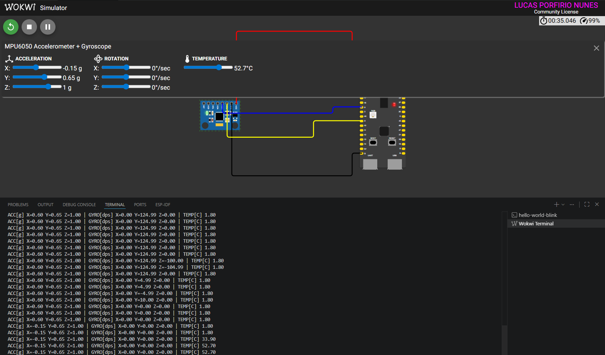

# Aplicacao embarcada com ESP32-S3 + MPU6050 no Wokwi

Projeto em C usando ESP-IDF no VS Code para ler um sensor MPU6050 simulado no Wokwi e imprimir aceleracao, giroscopio e temperatura no monitor serial.

## Requisitos atendidos

- ESP-IDF configurado para ESP32-S3
- Extensao Wokwi instalada no VS Code
- Sensor escolhido: MPU6050
- Circuito no Wokwi com alimentacao, GND e barramento I2C
- Inicializacao do sensor com a biblioteca `tny-robotics/mpu6050-esp-idf`
- Codigo em C compilando no ESP-IDF

## Pinos usados

- `SDA`: GPIO 8
- `SCL`: GPIO 9
- `VCC`: 3V3
- `GND`: GND

## Como executar

1. Abra a pasta `hello-world-blink` no VS Code.
2. Entre na sua conta/licenca do Wokwi na extensao, se ainda nao tiver feito isso.
3. Execute a task `ESP-IDF: Set Target esp32s3` se quiser regenerar o projeto.
4. Execute a task `ESP-IDF: Build`.
5. Inicie a simulacao do Wokwi no VS Code com o projeto aberto.
6. Capture o screenshot do monitor serial com as leituras.

## Evidencia de execucao

Simulacao do ESP32-S3 com o MPU6050 no Wokwi e leituras sendo exibidas no monitor serial:

